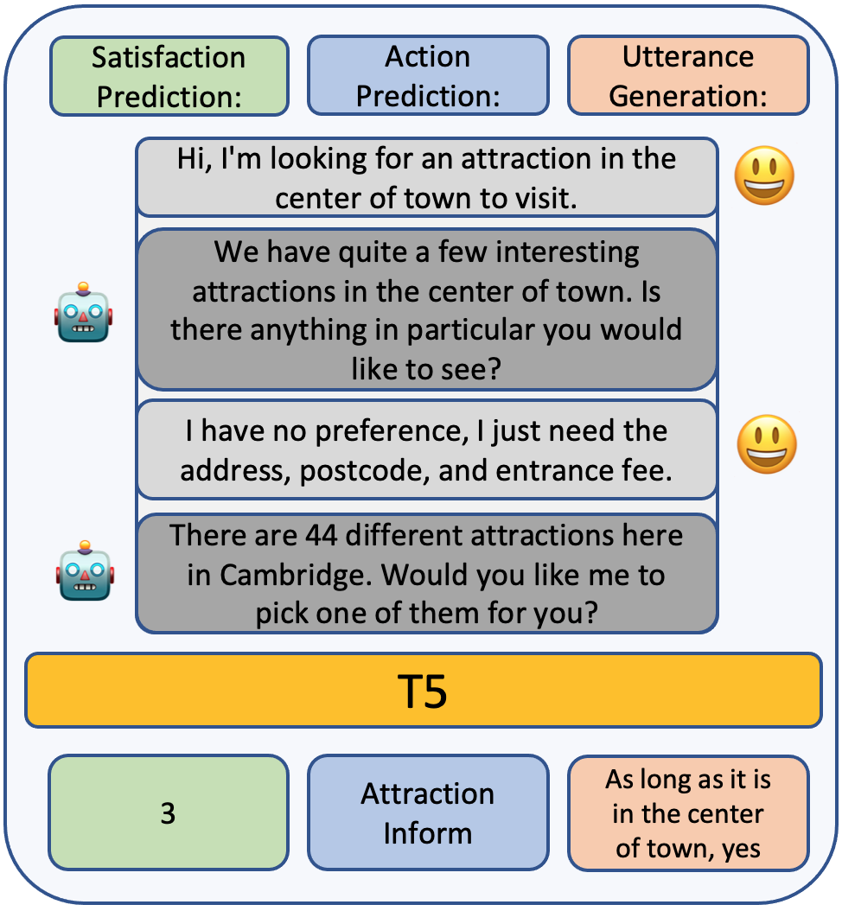
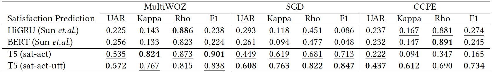
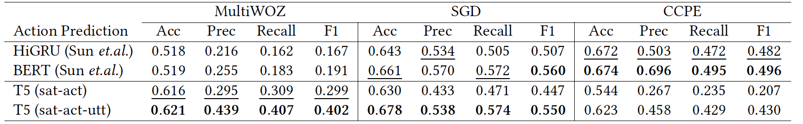
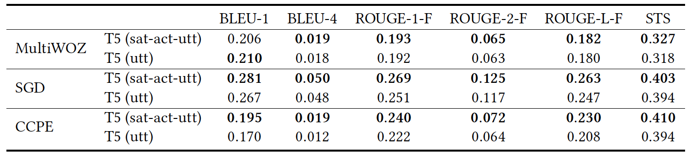
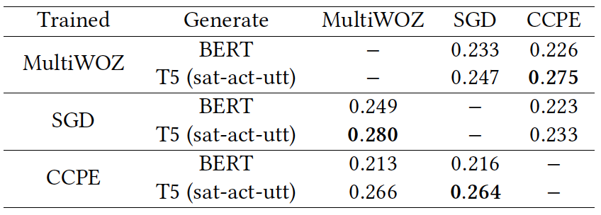

# user-simulation-t5

Official code repository of the paper [A Multi-Task Based Neural Model to Simulate Users in Goal-Oriented Dialogue Systems](https://dl.acm.org/doi/abs/10.1145/3477495.3531814)

**Model checkpoint files can be shared upon request.**

User Simulator that generates user-side utterance, predicts user's next action and satisfaction level.  
SOTA in Satisfaction and Action prediction in [USS dataset](https://arxiv.org/pdf/2105.03748).

<p align="center">
    
</p>
<p align="center">
    <b>Inference example of the trained T5 model on MultiWOZ 2.1 dataset</b>
</p>


We propose a multi-task based deep learning user simulator for goal oriented dialogue system that is trained to predict users’ satisfaction and action, while generating the users’ next utterance at the same time with shared weights. 
We show that 
1) a deep text-to-text multi-task neural model achieves state-of-the-art (SOTA) performance in user satisfaction and action prediction
2) through ablation analysis, adding utterance generation as an auxiliary task can boost the prediction performance via positive transfer between the tasks. 

## Results
**User Satisfaction Predictions**  
  

**User Action Predictions**  
  

**User-side Utterance Generation**  
  

**Cross-domain Unweigted Average Recall on User Satisfaction Prediction**  
  


## Citation
```
@inproceedings{10.1145/3477495.3531814, 
author = {Kim, To Eun and Lipani, Aldo}, 
title = {A Multi-Task Based Neural Model to Simulate Users in Goal Oriented Dialogue Systems}, 
year = {2022}, isbn = {9781450387323}, publisher = {Association for Computing Machinery}, address = {New York, NY, USA}, 
url = {https://doi.org/10.1145/3477495.3531814}, doi = {10.1145/3477495.3531814}, 
booktitle = {Proceedings of the 45th International ACM SIGIR Conference on Research and Development in Information Retrieval}, 
pages = {2115–2119}, numpages = {5}, location = {Madrid, Spain}, series = {SIGIR '22} 
}
```

## Environment
The author used AWS EC2 Instance to set up the environment:  

- Instance: `Deep Learning AMI (Amazon Linux 2) Version 57.0`  
- conda_env: `source activate pytorch_p38`
- requirements: `pip install -r requirements.txt`

